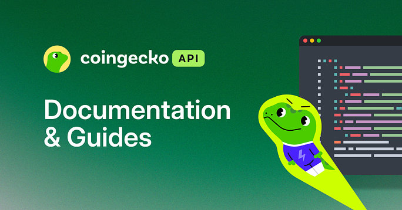

# CoinGecko API — OpenAPI Specs (OAS)

    

These OpenAPI 3.0 Specs (OAS) define the CoinGecko API — documenting its endpoints, request/response structures, and related metadata.

- Public/Demo API endpoints — [coingecko-public-api-v3.json](https://raw.githubusercontent.com/coingecko/coingecko-api-oas/refs/heads/main/coingecko-public-api-v3.json)
- Pro API endpoints — [coingecko-pro-api-v3.json](https://raw.githubusercontent.com/coingecko/coingecko-api-oas/refs/heads/main/coingecko-pro-api-v3.json)
- Onchain DEX (GeckoTerminal) API endpoints — [on-chain-dex-api-beta.json](https://raw.githubusercontent.com/coingecko/coingecko-api-oas/refs/heads/main/on-chain-dex-api-beta.json)

### Click to Learn More 👇

    

