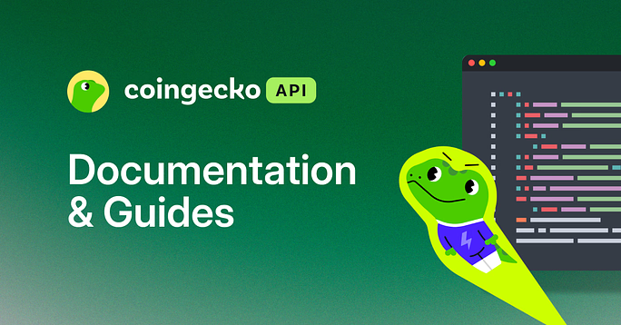

# CoinGecko API — OpenAPI Specs (OAS)

<p align="center">
    
</p>

<p align="center">
    <a href="https://github.com/OAI/OpenAPI-Specification"></a>
    <a href="https://docs.coingecko.com"></a>
    <a href="https://www.coingecko.com/en/api/pricing"></a>
</p>

These OpenAPI 3.0 Specs (OAS) define the CoinGecko API — documenting its endpoints, request/response structures, and related metadata.

## Table of Contents

- [Available Specs](#available-specs)
  - [CoinGecko Pro API](#coingecko-pro-api)
  - [CoinGecko Public/Demo API](#coingecko-publicdemo-api)
- [Usage](#usage)
  - [Swagger UI](#swagger-ui)
  - [Postman](#postman)
  - [Code Generation](#code-generation)
- [Contributing](#contributing)
- [Resources](#resources)

## Available Specs

### [CoinGecko Pro API](https://docs.coingecko.com/reference/endpoint-overview)

For production use with higher rate limits and additional endpoints.

| Spec | Description | Raw Link |
|------|-------------|----------|
| `coingecko-pro.json` | CoinGecko Pro API | [Download](https://raw.githubusercontent.com/coingecko/coingecko-api-oas/refs/heads/main/coingecko-pro.json) |
| `onchain-pro.json` | GeckoTerminal Onchain API (Pro) | [Download](https://raw.githubusercontent.com/coingecko/coingecko-api-oas/refs/heads/main/onchain-pro.json) |

### [CoinGecko Public/Demo API](https://docs.coingecko.com/v3.0.1/reference/authentication)

For testing and development purposes with limited rate limits.

| Spec | Description | Raw Link |
|------|-------------|----------|
| `coingecko-demo.json` | CoinGecko Public/Demo API | [Download](https://raw.githubusercontent.com/coingecko/coingecko-api-oas/refs/heads/main/coingecko-demo.json) |
| `onchain-demo.json` | GeckoTerminal Onchain API (Demo) | [Download](https://raw.githubusercontent.com/coingecko/coingecko-api-oas/refs/heads/main/onchain-demo.json) |

## Usage

### Swagger UI

You can visualize and interact with the API using [Swagger UI](https://swagger.io/tools/swagger-ui/):

1. Go to [Swagger Editor](https://editor.swagger.io/)
2. Click **File** → **Import URL**
3. Paste the raw URL of any spec file above

### Postman

Import the OpenAPI spec directly into Postman:

1. Open Postman and click **Import**
2. Select **Link** and paste the raw URL of the spec
3. Click **Import** to generate a Postman collection

### Code Generation

Generate client SDKs using [OpenAPI Generator](https://openapi-generator.tech/):

```bash
# Install OpenAPI Generator
npm install @openapitools/openapi-generator-cli -g

# Generate a Python client
openapi-generator-cli generate -i coingecko-pro.json -g python -o ./python-client

# Generate a TypeScript client
openapi-generator-cli generate -i coingecko-pro.json -g typescript-axios -o ./ts-client
```

Supported languages include: Python, JavaScript, TypeScript, Java, Go, Ruby, Rust, and [many more](https://openapi-generator.tech/docs/generators/).

## Contributing

We welcome contributions! If you find any issues or have suggestions:

1. Fork this repository
2. Create a feature branch (`git checkout -b fix/issue-description`)
3. Make your changes
4. Submit a Pull Request

## Resources

- 📚 [CoinGecko API Documentation](https://docs.coingecko.com)
- 💰 [API Pricing & Plans](https://www.coingecko.com/en/api/pricing)
- 📖 [API Terms of Service](https://www.coingecko.com/en/api_terms)
- 🦎 [GeckoTerminal](https://www.geckoterminal.com/) - DEX & DeFi data

---

<br />

**Click Here to Learn More 👇**

<p align="center">
    <a href="https://docs.coingecko.com">
        
    </a>
</p>
